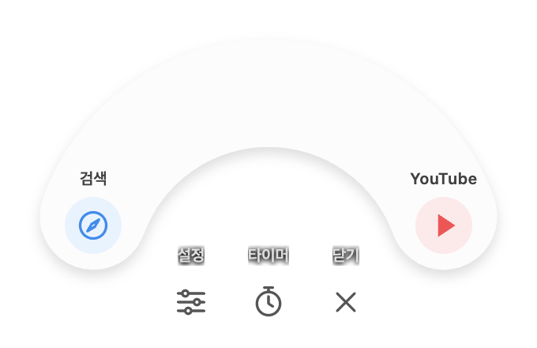

<div align="center">


# MOCHI · 모찌

**바탕화면에 사는 작은 친구. 자주 쓰는 것들은 한 번의 클릭으로.**

산책하는 햄스터, 부드럽게 펼쳐지는 바로가기, 나만의 집중 타이머.


[**macOS 다운로드 ↗**](https://github.com/chani337/desktop_mochi/releases/latest/download/DesktopCat.zip) · [**Windows 다운로드 ↗**](https://github.com/chani337/desktop_mochi/releases/latest/download/Mochi-2.1.0-win-x64.zip)

[시작하기](#시작하기) · [내 취향대로 설정](#내-취향대로-설정) · [소스 실행](#소스에서-실행하기) · [업데이트 기록](CHANGELOG.md)

</div>

---

## 작은 친구가 만드는 편한 하루

모찌는 바탕화면 위를 돌아다니는 데스크톱 캐릭터 앱입니다. 클릭하면 곡선형 팔레트가 펼쳐지고, 등록한 사이트나 파일을 바로 열 수 있어요. 집중할 때는 시간을 정해 함께 작업하고, 한동안 건드리지 않으면 모찌도 잠깐 쉬어갑니다.

<div align="center">

<p><sub>바로가기 이름과 색상은 자유롭게 바꿀 수 있습니다.</sub></p>
</div>

| | 모찌와 할 수 있는 것 |
| :--- | :--- |
| 🐹 **작은 데스크톱 친구** | 화면 위를 산책하고, 드래그하면 원하는 자리로 이동해요. |
| ✨ **곡선형 바로가기** | 캐릭터를 클릭하면 아이콘이 펼쳐져요. 최대 5개까지 등록할 수 있어요. |
| 🎨 **나만의 팔레트** | 이름, 주소, 아이콘, 색상, 순서를 직접 설정해요. |
| ⏱ **자유로운 집중 시간** | 1분부터 23시간 59분까지. 25분에 맞출 필요 없이 내 흐름대로 설정해요. |
| 💤 **10분 뒤 낮잠** | 10분 동안 캐릭터와 상호작용하지 않으면 잠들어요. |
| 📌 **메뉴바와 트레이** | 설정, 산책 제어, 위치 복구, 종료 기능에 빠르게 접근해요. |

## 시작하기

### macOS

**macOS 13 이상 · 제공 ZIP은 Apple Silicon(M1 이상)용**

1. [DesktopCat.zip 다운로드](https://github.com/chani337/desktop_mochi/releases/latest/download/DesktopCat.zip)
2. 압축을 풀고 `DesktopCat.app`을 **응용 프로그램** 폴더로 옮깁니다.
3. 앱을 실행하면 바탕화면에 모찌가 나타납니다.

배포용 앱은 Apple 공증을 받지 않았습니다. 실행이 차단되면 다운로드 출처를 확인한 후 **시스템 설정 → 개인정보 보호 및 보안 → 확인 없이 열기**를 사용하세요. Intel Mac은 아래 소스 빌드 방법을 이용할 수 있지만, 실제 Intel 기기에서는 검증하지 않았습니다.

### Windows

**Windows 10 / 11 · Intel/AMD 64비트(x64)**

1. [Mochi-2.1.0-win-x64.zip 다운로드](https://github.com/chani337/desktop_mochi/releases/latest/download/Mochi-2.1.0-win-x64.zip)
2. ZIP의 **전체 압축을 풀어주세요.**
3. 폴더 안의 `Mochi.exe`를 실행합니다.

별도 설치 과정 없이 실행하는 포터블 앱입니다. **EXE만 따로 옮기지 말고 폴더 전체를 보관**하세요. 서명되지 않은 앱이라 Windows에서 경고가 표시될 수 있습니다. 트레이 아이콘이 안 보이면 작업표시줄의 숨겨진 아이콘 목록을 확인하세요.

**새 버전으로 업데이트:** 다운로드 버튼에서 최신 ZIP을 받은 뒤, 트레이 메뉴에서 기존 모찌를 **종료**하세요. 새 ZIP을 별도 폴더에 전부 풀고 `Mochi.exe`를 실행하면 됩니다. 자동 업데이트 방식은 아니며, 기존 바로가기 설정은 그대로 유지됩니다.

> 배포 파일은 [GitHub Releases](https://github.com/chani337/desktop_mochi/releases)에 올라옵니다. 다운로드 버튼이 아직 열리지 않으면 릴리스 업로드 상태를 확인해 주세요.

## 내 취향대로 설정

### 자주 쓰는 링크 등록하기

1. 캐릭터를 클릭하고 팔레트의 **설정**을 엽니다.
2. 바로가기의 이름과 주소를 입력합니다. 웹사이트는 `https://www.youtube.com`처럼 전체 주소를 넣어주세요.
3. 아이콘, 색상, 순서를 고른 뒤 저장합니다.
4. 팔레트에서 해당 아이콘을 클릭하면 연결된 사이트나 파일이 열립니다.

브라우저 링크나 파일을 캐릭터 위로 끌어다 놓아 추가할 수도 있습니다. 바로가기는 최대 **5개**까지 지원하며, Mac과 Windows의 설정은 각각 저장됩니다.

### 모찌 크기 바꾸기 · macOS / Windows

캐릭터를 클릭한 뒤 **설정 → 모찌 크기** 슬라이더를 움직여 주세요. **100%부터 250%까지 25% 단위**로 조절하며, 변경 즉시 적용되고 자동 저장됩니다. 기본 크기는 **맥 100% · 윈도우 150%**입니다. 맥은 기존 크기를 유지하며, 윈도우는 크기 설정이 없으면 150%로 시작합니다.

### 집중 타이머 맞추기

팔레트의 **타이머**에서 시간과 분을 설정하고 시작하세요. 범위는 **1분 ~ 23시간 59분**입니다. 메뉴바 또는 트레이에서도 타이머 상태와 제어 메뉴를 확인할 수 있습니다.

Windows 타이머는 실제 종료 시각을 기준으로 동작해 컴퓨터가 잠든 시간도 포함합니다. 앱을 다시 열었을 때 유효한 종료 시각이 남아 있으면 이어집니다. macOS 앱은 설정한 길이를 저장하지만, 실행 중인 타이머는 앱 종료 후 이어지지 않습니다.

### 손에 익으면 더 빠르게

| 조작 | 동작 |
| :--- | :--- |
| 캐릭터 클릭 | 팔레트 열기 / 닫기 |
| 누르자마자 드래그 | 캐릭터 위치 이동 |
| 약 0.25초 누른 뒤 아이콘 방향으로 움직여 놓기 | 바로가기 실행 |
| 링크 또는 파일 드롭 | 바로가기 추가 |
| 메뉴바 / 트레이 메뉴 | 산책 제어, 설정, 위치 복구, 종료 |

<details>
<summary><strong>설정은 어디에 저장되나요?</strong></summary>

- **macOS:** 앱의 UserDefaults에 저장됩니다. 기존 설정을 유지하기 위해 번들 식별자 `local.desktopcat.babonyang`을 사용합니다.
- **Windows:** `%APPDATA%\mochi-desktop\settings.json`에 저장됩니다.
- 두 운영체제 사이의 자동 동기화는 지원하지 않습니다.

</details>

## 소스에서 실행하기

```sh
git clone https://github.com/chani337/desktop_mochi.git
cd desktop_mochi
```

### macOS · Swift / AppKit

Xcode Command Line Tools가 필요합니다. 설치되어 있지 않다면 `xcode-select --install`로 설치하세요.

```sh
cd macos/DesktopCat
./build.command
open DesktopCat.app
```

현재 Mac의 아키텍처로 앱을 빌드하고 로컬 실행용 서명을 적용합니다. 이미지 리소스와 앱 정보를 함께 번들에 복사합니다.

### Windows · Electron

Node.js 22 이상과 npm이 필요합니다.

```sh
cd windows/mochi-desktop
npm ci
npm start
```

```sh
# 로직 테스트
npm test

# Windows x64 ZIP 생성
npm run build:win
```

결과물은 저장소 루트의 `outputs/Mochi-Windows/`에 생성됩니다.

<details>
<summary><strong>프로젝트 구조</strong></summary>

```text
desktop_mochi/
├── macos/DesktopCat/       # 네이티브 macOS 앱
│   ├── Sources/           # Swift / AppKit
│   ├── Resources/         # 기본·수면 캐릭터
│   └── build.command      # 앱 번들 빌드
├── windows/mochi-desktop/  # Electron 앱
│   ├── assets/            # 캐릭터 이미지
│   ├── main.js            # 창·트레이·저장·타이머
│   ├── renderer.js        # 캐릭터·팔레트·설정 화면
│   └── test/              # 로직 테스트
├── docs/images/           # 미리보기
└── CHANGELOG.md            # 버전별 업데이트 기록
```

</details>

## 업데이트

**v2.1.1 · 2026.09.29 — macOS 크기 조절**

- 맥 설정에서도 캐릭터 크기를 100% ~ 250%로 조절하고 자동 저장
- 맥 기본 크기는 기존과 같은 100% 유지
- Windows 다운로드는 크기 조절을 지원하는 기존 v2.1.0 유지


**v2.1.0 · 2026.09.29 — Windows 크기 조절**

- 설정에서 캐릭터 크기를 100% ~ 250%로 조절하고 자동 저장
- 기본 크기를 150%로 확대하고, 확대 시 드래그 범위와 팔레트 위치도 반영


**v2.0.1 · 2026.09.29 — Windows 수정**

- 다른 창 위에서 팔레트를 열 때 표시 순서와 클릭 처리를 개선
- Windows 자동 산책을 기본 해제: 실행할 때마다 제자리에 머물며 트레이에서 직접 산책 시작 가능


**v2.0.0 · 2026.09.29**

- 새로 제작한 크림색 햄스터 모찌와 수면 이미지 적용
- Windows x64 포터블 버전 추가
- 시간·분을 직접 조절하는 집중 타이머와 메뉴바 / 트레이 제어
- 곡선형 바로가기 팔레트와 링크 편집 기능 정리
- 10분 미상호작용 수면 동작 적용
- macOS / Windows 실행 및 설정 가이드 추가

전체 변경 사항은 [CHANGELOG.md](CHANGELOG.md)에서 확인할 수 있습니다.

## 검증 범위와 기여

macOS 네이티브 빌드, Windows 패키지 생성 및 무결성 확인, Electron 공통 UI와 로직 테스트를 수행했습니다. Windows 실제 기기에서의 창 표시, 트레이, 화면 배율별 동작은 아직 직접 검증하지 않았습니다.

캐릭터 이미지는 이 프로젝트용으로 이미지 생성 도구를 사용해 새로 제작했습니다. 문제나 개선 아이디어는 [Issues](https://github.com/chani337/desktop_mochi/issues)에 남겨주세요.

커밋은 `feat:`, `fix:`, `docs:`, `chore:` 등의 **Conventional Commits** 형식을 사용합니다. 예: `docs: improve setup guide`.

---

<div align="center">
<sub>작은 모찌와 함께, 오늘도 내 속도로.</sub>
</div>
