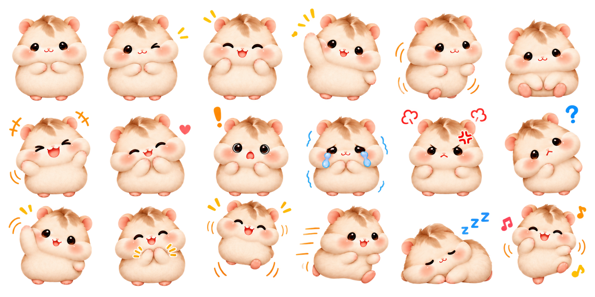

<div align="center">


# MOCHI · 모찌

### 내 바탕화면에 작은 친구 하나.

자주 쓰는 앱은 한 번의 클릭으로.<br />
집중할 땐 함께 앉고, 쉬는 동안엔 함께 잠드는 데스크톱 친구.


[**Mac 다운로드**](https://github.com/chani337/desktop_mochi/releases/download/v2.4.2/DesktopCat.zip) · [**Windows 설치하기**](https://github.com/chani337/desktop_mochi/releases/download/v2.4.2/Mochi-Setup-2.4.2.exe) · [모든 릴리스](https://github.com/chani337/desktop_mochi/releases)

[시작하기](#시작하기) · [사용과 설정](#사용과-설정) · [업데이트](#자동-업데이트) · [문제 해결](#문제-해결) · [변경 기록](#버전별-변경-기록)

</div>

---

## 작지만 할 일은 확실하게

| 기능 | 모찌와 할 수 있는 일 |
| :--- | :--- |
| **곡선형 바로가기** | 모찌를 클릭해 사이트·앱·파일을 열어요. 최대 10개, 한 페이지에 5개씩 표시해요. |
| **내 취향의 모션** | 18가지 포즈를 8가지 상황에 각각 지정해요. 미리보기와 자동 저장을 지원해요. |
| **방향에 맞는 움직임** | 산책하거나 드래그할 때 이동 방향에 맞춰 왼쪽·오른쪽을 바라봐요. |
| **자유로운 크기** | 100~250% 범위에서 25% 단위로 조절해요. |
| **집중 타이머** | 1분부터 23시간 59분까지, 시간과 분을 직접 정해요. |
| **10분 뒤 낮잠** | 모찌와 10분 동안 상호작용하지 않으면 잠드는 모습으로 바뀌어요. |
| **업데이트와 백업** | 앱 안에서 새 버전을 확인하고, 설정 백업을 최근 20개까지 보관해요. |

<div align="center">

<p><sub>이름·아이콘·색상·순서는 직접 설정할 수 있어요. 이미지는 팔레트 구성 예시입니다.</sub></p>
</div>

## 시작하기

### 다운로드

| 플랫폼 | 지원 환경 | v2.4.2 다운로드 | 앱 내 업데이트 |
| :--- | :--- | :--- | :--- |
| **macOS** | macOS 13 이상 · Apple Silicon | [DesktopCat.zip](https://github.com/chani337/desktop_mochi/releases/download/v2.4.2/DesktopCat.zip) | 지원 |
| **Windows 설치형** | Windows 10 / 11 · x64 | [Mochi-Setup-2.4.2.exe](https://github.com/chani337/desktop_mochi/releases/download/v2.4.2/Mochi-Setup-2.4.2.exe) | 지원 |
| **Windows 포터블** | Windows 10 / 11 · x64 | [Mochi-2.4.2-win-x64.zip](https://github.com/chani337/desktop_mochi/releases/download/v2.4.2/Mochi-2.4.2-win-x64.zip) | 자동 교체 미지원 |

### Mac 설치

1. ZIP을 내려받고 압축을 풉니다.
2. 기존 모찌가 실행 중이면 메뉴바에서 **종료**합니다.
3. Finder에서 `DesktopCat.app`을 **응용 프로그램** 폴더로 옮깁니다.
4. **응용 프로그램 폴더에 있는 모찌**를 실행합니다.

> 다운로드 폴더나 macOS 임시 실행 위치에서는 업데이트가 차단될 수 있어요. 압축을 푼 위치에서 계속 실행하지 말고, Finder로 옮긴 앱을 실행해 주세요.

배포 앱은 Apple 공증을 받지 않았습니다. 개발자 확인 경고가 뜨면 다운로드 출처를 확인한 뒤 **시스템 설정 → 개인정보 보호 및 보안**의 실행 허용 안내를 확인하세요. 제공 ZIP은 Apple Silicon용이며, Intel Mac의 소스 빌드는 실제 기기에서 검증하지 않았습니다.

### Windows 설치

1. 기존 모찌가 실행 중이면 작업표시줄 알림 영역의 모찌 아이콘에서 **종료**합니다. 아이콘은 `^` 안에 있을 수도 있어요.
2. 설치형 EXE를 실행하고 설치 안내를 따릅니다.
3. 모찌를 실행합니다. 처음에는 제자리에 머물고, 트레이의 **산책 시작**으로 움직이게 할 수 있어요.

설치형과 포터블은 같은 설정 위치를 사용합니다. 포터블을 쓰려면 ZIP **전체를 압축 해제**한 뒤 `Mochi.exe`를 실행하세요. Windows 배포용 코드 서명은 아직 적용하지 않았습니다.

> **v2.4.1 이하에서 업데이트 설치가 막혔다면:** 이번 한 번은 트레이에서 모찌를 종료하고 v2.4.2 설치 파일을 직접 실행하세요. 새 자동 종료 방식은 **v2.4.2 설치 후 다음 업데이트부터** 적용됩니다.

## 사용과 설정

### 기본 조작

| 조작 | 동작 |
| :--- | :--- |
| 모찌 클릭 | 바로가기 팔레트 열기·닫기 |
| 누르자마자 드래그 | 원하는 위치로 이동 |
| 약 0.25초 누른 뒤 아이콘 방향으로 움직여 놓기 | 바로가기 실행 |
| 링크·파일을 모찌 위에 드롭 | 바로가기 추가 |
| 팔레트의 **설정** | 바로가기와 크기 설정 |
| 팔레트의 **타이머** | 집중 시간 설정·시작·종료 |
| 메뉴바·트레이의 **모찌 데려오기** | 캐릭터 위치 복구 |

### 바로가기 · 최대 10개

**모찌 클릭 → 설정**에서 이름과 주소를 입력하고, 아이콘·색상·순서를 정한 뒤 **저장**하세요. 웹 주소는 `https://www.youtube.com`처럼 입력하면 됩니다.

설치된 앱은 **설치된 앱 가져오기** 버튼으로 등록할 수 있어요. Mac은 앱 선택창을, Windows는 앱 검색 목록과 파일 직접 찾기를 제공합니다. 앱을 선택한 뒤에도 **저장**을 눌러 주세요.

빈 줄은 팔레트에서 숨겨지고, 6개 이상 등록하면 **…** 버튼으로 다음 페이지를 엽니다. **←** 버튼으로 돌아올 수 있어요.

### 모션 · 18가지 포즈, 8가지 상황

- **Mac:** 설정 → **모션 설정…**, 또는 메뉴바 → **모션 설정…**
- **Windows:** 설정 → **모션** 탭. 아래로 스크롤하면 모든 상황이 보여요.

| 상황 | 기본 모션 |
| :--- | :--- |
| 가만히 있을 때 | 기본 대기 |
| 산책할 때 | 걷기 |
| 10분 쉬고 잠들 때 | 잠자기 |
| 잡아서 옮길 때 | 손 번쩍 |
| 내려놓을 때 | 점프 |
| 클릭·바로가기 반응 | 손 흔들기 |
| 타이머 집중 중 | 앉기 |
| 타이머 완료 | 박수 |

각 상황에서 원하는 포즈를 고르면 미리보기와 실제 캐릭터에 바로 반영되고 자동 저장됩니다. **기본 모션으로 되돌리기**는 모션 선택만 초기화하며, 링크·크기·타이머 설정은 유지해요.

<details>
<summary><strong>18가지 포즈 한눈에 보기</strong></summary>



포즈별로 호흡·흔들림·점프 등의 움직임 효과를 적용합니다. 정지 포즈를 활용한 애니메이션이며, 팔다리가 프레임마다 바뀌는 영상 방식은 아닙니다. 아트워크 제작 과정은 [모션 이미지 안내](docs/motion-artwork.md)에 기록했습니다.

</details>

### 크기와 산책

**설정 → 모찌 크기**에서 100~250%를 25% 단위로 조절하세요. 변경 즉시 적용되고 다음 실행에도 유지됩니다. 기본 크기는 **Mac 100% · Windows 150%**예요.

산책은 메뉴바·트레이에서 켜거나 끌 수 있습니다. **Windows는 실행할 때마다 정지 상태로 시작**하고, **Mac은 이전 산책 설정을 기억**합니다. 처음 설정이 없는 Mac은 산책이 켜져 있어요. 산책과 드래그 모두 이동 방향에 맞춰 캐릭터가 좌우로 반전됩니다.

### 집중 타이머

**팔레트 → 타이머**에서 시간과 분을 입력하세요. 범위는 **1분~23시간 59분**입니다. 집중 중과 완료 시의 모션도 각각 지정할 수 있어요.

| 동작 | Mac | Windows |
| :--- | :--- | :--- |
| 설정한 시간 길이 저장 | 지원 | 지원 |
| 앱을 종료했다가 열었을 때 타이머 이어가기 | 미지원 | 종료 시각이 남아 있으면 지원 |
| 컴퓨터가 잠든 동안의 경과 시간 반영 | 지원 | 지원 |

## 자동 업데이트

메뉴바·트레이의 **업데이트 확인…**에서 직접 확인할 수 있습니다. 자동 확인은 v2.3.0부터 지원하며, v2.2.2 이하나 Windows 포터블 사용자는 지원 버전을 한 번 직접 설치해야 합니다.

### Windows 설치형 · v2.4.2

실행 후 약 15초 뒤, 이후 약 6시간마다 새 버전을 확인합니다. 다운로드가 끝나면 **지금 업데이트** 또는 **나중에**를 선택할 수 있어요.

```text
지금 업데이트
    ↓
설정 저장 · 백업
    ↓
업데이트 도우미 준비
    ↓
모찌 자동 종료
    ↓
프로세스 종료 확인
    ↓
새 버전 설치 · 재실행
```

도우미가 준비되지 않으면 모찌를 종료하지 않습니다. 종료 확인은 최대 30초 동안 기다리며, 모찌가 종료되지 않으면 설치를 시작하지 않아요. 중복 클릭으로 설치가 여러 번 실행되는 것도 방지합니다. **나중에**를 골랐다면 **업데이트 확인…**에서 다시 진행할 수 있어요.

### Mac

Sparkle이 새 버전 확인·다운로드·설치·재실행을 처리하며, 업데이트 목록과 ZIP의 서명을 검증합니다. **응용 프로그램 폴더에 옮긴 앱**에서 실행하세요. v2.4.1부터 다운로드 폴더·임시 실행 위치의 업데이트 제한을 한글로 안내합니다.

## 설정 보관과 복원

앱 시작·업데이트 전 등에 설정을 백업하고 최근 **20개**를 보관합니다. 같은 내용은 중복 저장하지 않습니다. 메뉴바·트레이의 **설정 백업 폴더 열기**, **설정 복원…**을 사용하세요. 복원 전에도 현재 설정을 백업해요.

| 항목 | Mac | Windows |
| :--- | :--- | :--- |
| 현재 설정 | UserDefaults · `local.desktopcat.babonyang` | `%APPDATA%\mochi-desktop\settings.json` |
| 백업 폴더 | `~/Library/Application Support/Mochi/Backups/` | `%APPDATA%\mochi-desktop\backups\` |
| 설치 진단 로그 | — | `%APPDATA%\mochi-desktop\update-install.log` |

업데이트해도 기존 링크·크기·모션 설정을 유지합니다. 두 운영체제 사이의 설정 자동 동기화는 지원하지 않으며, 백업 기능을 사용하기 전에 이미 사라진 링크는 복구할 수 없습니다.

## 문제 해결

| 증상 | 확인할 내용 |
| :--- | :--- |
| **Windows 설치 중 모찌가 실행 중이라고 나와요** | v2.4.1 이하라면 트레이에서 종료한 뒤 v2.4.2 EXE를 직접 설치하세요. 새 종료 흐름은 설치 후 다음 업데이트부터 적용됩니다. |
| **Windows 포터블에서 업데이트가 안 돼요** | ZIP은 자동 교체 대상이 아닙니다. 설치형 EXE로 전환해 주세요. 기존 설정을 사용합니다. |
| **Mac 업데이트가 실행 위치 때문에 차단돼요** | 모찌 종료 → Finder로 응용 프로그램 폴더에 이동 → 그곳의 앱 실행 순서로 진행하세요. |
| **모찌가 너무 작아요** | 설정의 크기 슬라이더를 올려 주세요. 최대 250%입니다. |
| **모찌가 계속 움직여요** | 메뉴바·트레이에서 산책을 멈춰 주세요. Windows는 다음 실행 때도 정지 상태로 시작합니다. |
| **등록한 앱·링크가 안 보여요** | 설정에서 저장했는지, 6번째 이후 항목이 다음 페이지에 있는지 확인하세요. |
| **캐릭터가 화면에서 안 보여요** | 메뉴바·트레이에서 **모찌 데려오기**를 선택하세요. |
| **설정이 잘못 바뀌었어요** | **설정 복원…**에서 이전 백업을 선택하세요. |

해결되지 않는 문제는 [Issues](https://github.com/chani337/desktop_mochi/issues)에 **운영체제, 모찌 버전, 오류 문구, 재현 순서**를 함께 남겨 주세요.

## 버전별 변경 기록

| 버전 | 주요 변경 |
| :--- | :--- |
| **2.4.2** | Windows 종료 확인 후 업데이트 설치·재실행, 중복 설치 방지와 실패 안내 |
| **2.4.1** | 좌우 이동 방향 반영, Mac 업데이트 실행 위치 안내 |
| **2.4.0** | 18가지 포즈, 8가지 상황별 모션 설정·미리보기·자동 저장 |
| **2.3.0** | Mac·Windows 앱 내 업데이트, Windows 설치형, 설정 백업·복원 |
| **2.2.2** | 앱 등록 오류와 공백·한글·특수문자 경로 처리 수정 |
| **2.2.1** | 설치된 앱 가져오기 |
| **2.2.0** | 바로가기 최대 10개와 페이지 전환 |
| **2.1.2** | Mac 팔레트 가독성 개선 |
| **2.1.1 / 2.1.0** | Mac / Windows 캐릭터 크기 조절 |
| **2.0.1** | Windows 팔레트 표시 개선과 기본 산책 해제 |
| **2.0.0** | 새 햄스터 캐릭터, Windows 지원, 자유로운 타이머, 10분 뒤 수면 |

상세 내역은 [CHANGELOG.md](CHANGELOG.md), 배포 파일은 [GitHub Releases](https://github.com/chani337/desktop_mochi/releases)에서 확인하세요.

## 소스에서 실행하기

```sh
git clone https://github.com/chani337/desktop_mochi.git
cd desktop_mochi
```

### Mac · Swift / AppKit

Xcode Command Line Tools가 필요합니다. 미설치 시 `xcode-select --install`로 설치하세요.

```sh
cd macos/DesktopCat
./build.command
open DesktopCat.app
```

현재 Mac 아키텍처로 빌드하고 로컬 실행용 서명을 적용합니다. 빌드 스크립트가 Sparkle 의존성을 준비하므로 최초 빌드에는 네트워크 연결이 필요합니다.

### Windows · Electron

Node.js 22 이상과 npm이 필요합니다.

```sh
cd windows/mochi-desktop
npm ci
npm start
```

```sh
npm test            # 로직·업데이트 도우미 검사
npm run build:win  # Windows x64 설치 EXE와 ZIP 생성
```

결과물은 저장소 루트의 `outputs/Mochi-Windows/`에 생성됩니다. 개발 실행과 포터블에서는 설치형 자동 업데이트를 실행하지 않습니다.

<details>
<summary><strong>프로젝트 구조와 배포</strong></summary>

```text
desktop_mochi/
├── macos/DesktopCat/          # Swift / AppKit 네이티브 앱
│   ├── Sources/               # 캐릭터·모션·설정·Sparkle 업데이트
│   ├── Resources/             # 캐릭터 이미지와 모션 목록
│   └── build.command
├── windows/mochi-desktop/     # Electron 앱
│   ├── assets/                # 캐릭터 이미지와 모션 목록
│   ├── main.js                # 창·트레이·설정·타이머
│   ├── renderer.js            # 캐릭터·팔레트·설정 화면
│   ├── updates.js             # 업데이트 확인·다운로드·설치 안내
│   ├── update-handoff.js      # 업데이트 도우미 준비
│   ├── install-update.ps1     # 종료 대기 후 설치 실행
│   └── test/
├── scripts/                   # 릴리스 빌드·서명 검증·게시
├── docs/                      # 이미지·릴리스 안내·제작 기록
└── CHANGELOG.md
```

배포는 [릴리스 가이드](docs/RELEASING.md)를 따릅니다. Mac ZIP·서명된 appcast와 Windows EXE·blockmap·업데이트 메타데이터·ZIP을 함께 게시합니다.

커밋 메시지는 한글 Conventional Commits 형식입니다. 예: `docs: 최신 버전 설치 및 업데이트 안내 정리`.

</details>

## 검증 범위

v2.4.2는 **Node 검사 20개**, macOS에서 실행한 **Electron UI 통합 검사**, **Mac 빌드**, **Windows 패키징과 배포 파일 무결성 확인**을 수행했습니다. Mac의 서명된 업데이트 목록 검증과 새 버전 발견도 별도 테스트 앱에서 확인했습니다.

**실제 Windows PC에서의 설치·종료·재실행 전체 과정, 창 표시·트레이·배율별 동작은 이 환경에서 직접 검증하지 못했습니다.** Mac 업데이트도 실제 설치·재실행 전체 과정의 검증을 완료한 것은 아닙니다.

---

<div align="center">
<sub>작은 모찌와 함께, 오늘도 내 속도로.</sub>
</div>
